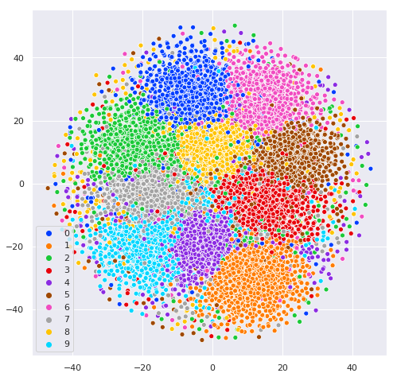
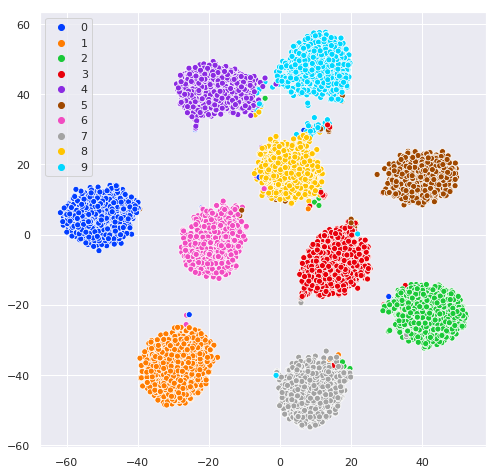

## Importance Weighted Gaussian Mixture VAE

Implementing [IWAE](https://arxiv.org/pdf/1509.00519.pdf) on VAE with a [Gaussian prior](https://arxiv.org/pdf/1611.05148.pdf).

### Loss derivation

### Results on MNIST
|    |  VAE  |  IWAE  |  GM-VAE  | IW-GM-VAE |
| -- | ----- | -----  | ------- | ------- |
| Recon. Loss | 0.1854 | 0.1837 | 0.2044 | 0.1863 |
| KL Loss  | 0.1645 | 0.1509 | 0.3748 | 0.4224 |
| Accuracy | 0.9732 | 0.9771 | 0.9637 | 0.9621 |

### TSNE plots

|    |       |
| -- | ----- |
| VAE | |
| IWAE |  |
| GM-VAE | |
| IW-GM-VAE |  |

### Code Reference 
1. IWAE: https://github.com/AntixK/PyTorch-VAE/blob/master/models/iwae.py
2. GM-VAE: https://github.com/yjlolo/vae-audio/blob/master/base/base_model.py